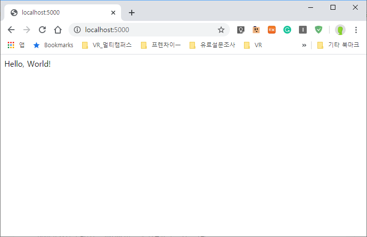
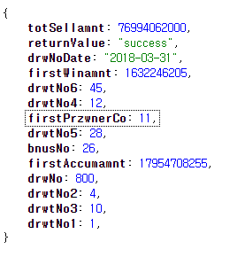

# 파이썬 중급

Flask 를 이용해 파이썬으로 웹서버 구축하기

## 준비

1. Flask 접속
2. 


## 서버기동



- API



```python
\# lotto 번호를 가져와서 보여주는 서버

\# https://www.nlotto.co.kr/common.do?method=getLottoNumber&drwNo=회차번호


@app.route('/lotto_result/<int:round>')

def lotto_result(round):

  url = f'https://www.nlotto.co.kr/common.do?method=getLottoNumber&drwNo={round}' 

  result = requests.get(url).json()


  winner = []

  for i in range (1,7):

​    winner.append(result.get(f'drwtNo{i}'))

​    \# winner.append(result[f'drwtNo{i}'])


  winner.append(result.get('bnusNo'))  


  return json.dumps(winner)

  

app.run(debug=True)      # Python 에서 서버 실행하기


```


